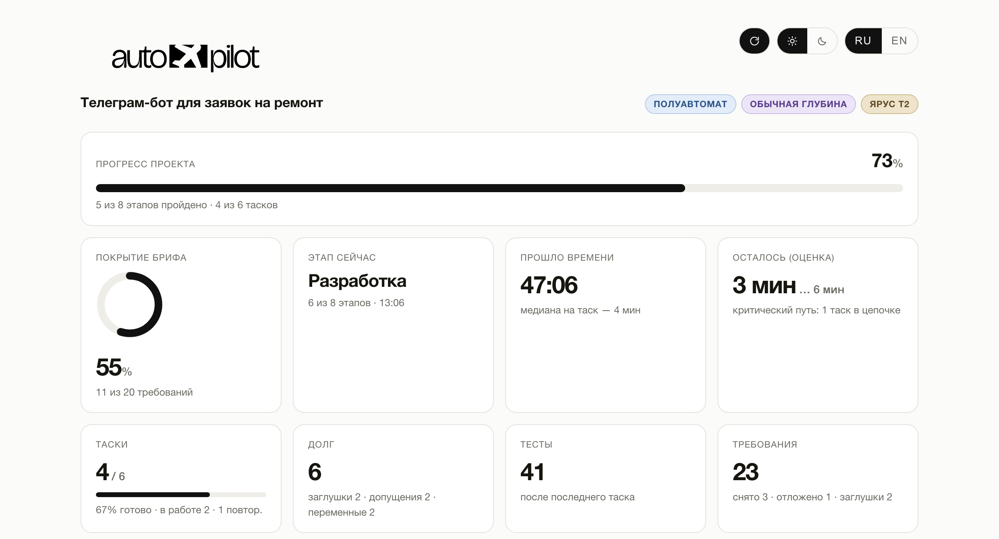
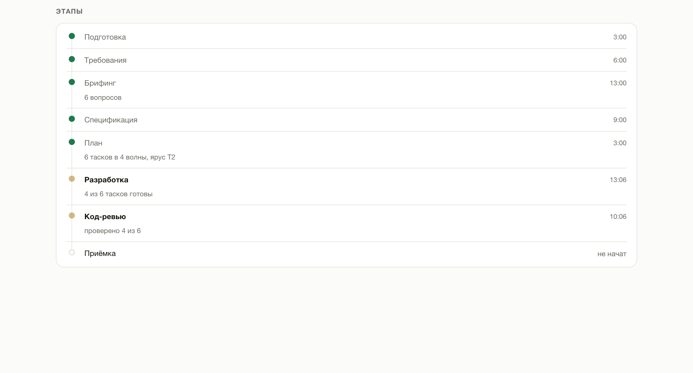
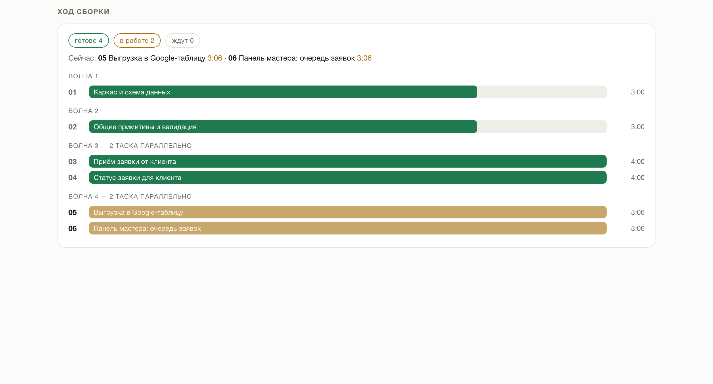

<p align="center">
  <picture>
    <source media="(prefers-color-scheme: dark)" srcset="assets/autopilot-logo-dark.png">
    <source media="(prefers-color-scheme: light)" srcset="assets/autopilot-logo-light.png">
    
  </picture>
</p>

<p align="center">
  <a href="https://skills.sh/nick-vels/skills"></a>
</p>

<p align="center"><strong>Расскажи словами, что нужно построить — получи готовый проект.</strong></p>

Autopilot — фреймворк разработки, skill, который берёт вашу идею, задаёт вопросы ровно там, где в ней есть развилки, а дальше сам пишет спецификацию, продумывает то, о чём вы не думали, разбивает работу на таски и собирает проект целиком. Вам не нужно читать спецификацию, оценивать таски или разбираться в коде.

Работает сам по себе: ставить что-то ещё не нужно.

<p align="center">
  <a href="assets/autopilot-dashboard.png"></a>
  <a href="assets/autopilot-dashboard.png"></a>
  <a href="assets/autopilot-dashboard.png"></a>
</p>

<p align="center"><sub>Показатели · этапы · ход сборки — <a href="assets/autopilot-dashboard.png">открыть дашборд целиком</a></sub></p>

**И вы всё время видите, что происходит.** В начале сборки агент сам открывает дашборд — один HTML-файл, который не надо искать и запускать. На нём видно, сколько проекта уже позади, какая часть вашей задачи уже закрыта, на каком этапе сборка, что делается прямо сейчас и сколько ещё осталось. Таймеры идут вживую, страница обновляется сама, интернет не нужен.

---

## Установка

### Не хотите открывать терминал

Откройте своего AI-агента — Claude Code, Cursor, Codex — и вставьте ему этот текст:

```
Установи мне навык Autopilot. Выполни в терминале:

npx skills add nick-vels/skills --skill autopilot -g -y -a <подставь себя: claude-code, cursor, codex>

Если npx не найдётся — дай мне ссылку, где скачать Node.js, и подожди.
Больше ничего не устанавливай.
Когда закончишь — напиши одной строкой, что готово и что надо перезапустить сессию.
```

Агент всё сделает сам. После этого перезапустите его — навыки читаются при старте.

Это команда для **первой** установки. Обновлять потом — [другой командой](#обновление-и-удаление).

### Через терминал

Скопируйте строку:

```bash
npx skills add nick-vels/skills
```

Установщик спросит, какие навыки поставить и для каких агентов — просто подтвердите.

<details>
<summary>Установка одной командой, без вопросов</summary>

```bash
npx skills add nick-vels/skills --skill autopilot -a claude-code -g -y
```

| Флаг | Что делает |
|------|------------|
| `--skill autopilot` | Ставит только Autopilot |
| `-a claude-code` | Ставит для Claude Code |
| `-g` | Глобально — навык доступен во всех проектах |
| `-y` | Не задавать вопросов |

Без `-g` навык встанет только в текущую папку проекта.

</details>

**Требуется:** [Node.js](https://nodejs.org) (для `npx`) и любой поддерживаемый AI-агент — Claude Code, Cursor, Codex и [70+ других](https://github.com/vercel-labs/skills#supported-agents). Больше ничего.

---

## Как пользоваться

Откройте агента в папке будущего проекта и напишите:

```
/autopilot Хочу телеграм-бота, который принимает заявки на ремонт техники
и складывает их в Google-таблицу
```

Или просто опишите задачу своими словами — агент сам поймёт, что пора включить Autopilot:

> Собери мне под ключ сайт-визитку для студии маникюра, не задавай лишних вопросов

**Если задача большая — напишите её в файл.** В одну строку чата подробное описание не помещается, а мельчить не надо: чем больше вы расскажете, тем меньше придётся додумывать за вас. Создайте рядом с проектом файл — название любое, `brief.md`, `идея.txt`, `задача.md` — и опишите там всё в свободной форме: что за проект, для кого, что должно уметь, что вам не нравится у конкурентов, какие есть ограничения по деньгам и срокам. Потом просто укажите на него:

```
/autopilot brief.md
```

```
/autopilot deep docs/идея.md только без оплаты картой
```

Агент прочитает файл и возьмёт его содержимое как задачу; ваш файл при этом останется нетронутым, а его копия ляжет в `.autopilot/` — именно с ней в конце сверяется результат. Слова, дописанные рядом с путём, идут в ту же задачу.

Дальше нужно будет только ответить на несколько вопросов в самом начале.

В ответ агент первым делом скажет, в каком режиме работает и какие есть ещё, и **сам откроет дашборд** — так что помнить команды и искать файлы не нужно:

```
Режим: полуавтомат · глубина: обычная — спрошу только то, что в задаче не определено, дальше соберу сам.
Дашборд открыл: .autopilot/dashboard.html — обновляется сам.
Память проекта — AGENTS.md (+ CLAUDE.md со ссылкой). Скажи, если нужен другой.

Можно переключить в любой момент, просто скажи:
• «полный автомат» — не спрашиваю вообще ничего
• «ручной режим» — согласуешь со мной спецификацию и список тасков
• «строго по брифу» / «проработай глубоко» — меньше или больше проработки сверх сказанного
```

---

## Три режима

После `/autopilot` можно дописать, насколько плотно вы хотите участвовать. Ничего не написали — работает **полуавтомат**.

| Режим | Как включить | Что спрашивают у вас |
|---|---|---|
| **Полный автомат** | `/autopilot full ...` или «полный автомат» | Ничего. В конце — список решений, принятых за вас |
| **Полуавтомат** *(по умолчанию)* | ничего дописывать не нужно | Только то, что в задаче не определено: обычно 2–8. Всё однозначно — ни одного; задача большая и сырая — столько, сколько нужно |
| **Ручной** | `/autopilot manual ...` или «ручной режим» | Вопросы, потом ваше «ок» на спецификацию и на список тасков |

```
/autopilot full лендинг для доставки пиццы

/autopilot Телеграм-бот для записи на маникюр

/autopilot manual CRM для автосервиса, хочу сам утвердить спецификацию
```

Слова `full`, `semi`, `manual` пишутся без дефисов. Режим можно поменять по ходу — «переключись в ручной», применится со следующего этапа.

**Что не меняется ни в одном режиме:** агент спросит перед необратимым — публикацией, оплатой, рассылкой, удалением данных. И ни один режим не отключает сверку с вашей изначальной задачей.

---

## Глубина проработки

Отдельная ручка, независимая от режима. Режим решает, **сколько у вас спросят**; глубина — **сколько додумают за вас**.

| Глубина | Как включить | Что делает агент |
|---|---|---|
| **Строго** | `/autopilot strict ...` или «строго по брифу», «ничего не добавляй» | Только то, что вы написали. Никаких своих фич — даже хороших. Ошибки и пустые состояния всё равно обрабатываются: без них требование просто не работает |
| **Обычная** *(по умолчанию)* | ничего дописывать не нужно | Прорабатывает то, где пробел явно испортит результат. Своё добавить может, но с привязкой к вашему требованию |
| **Максимальная** | `/autopilot deep ...` или «проработай глубоко», «продумай за меня» | Каждое требование прогоняется по полному списку: первый запуск, пустой экран, неверный ввод, отказ, обрыв, рост, права, последствия |

```
/autopilot strict форма обратной связи, ровно как описал

/autopilot deep интернет-магазин керамики

/autopilot full deep маркетплейс мастеров
```

Порядок слов не важен, оба параметра необязательны. Глубину, как и режим, можно поменять по ходу: «поменьше отсебятины» или «продумай глубже».

**На любой глубине действует одно правило:** всё, что агент добавил от себя, привязано к вашему требованию и попадает в финальный отчёт отдельным списком. Фича, которая ни к чему не привязана, вырезается.

---

## Две вещи, которые Autopilot делает иначе

### Ваша задача не теряется по дороге

Обычная проблема сборки «по описанию»: вы надиктовали большой бриф, дальше пошли вопросы, спецификация, таски, код — и на выходе половины из того, что вы просили, просто нет. Не потому что отказались, а потому что на каком-то шаге это перестало упоминаться.

Autopilot первым делом разбирает ваш текст на **пронумерованные требования** и записывает их дословно в файл. Дальше у каждого требования есть статус, и на каждом этапе стоит проверка:

- после спецификации — ни одно требование не осталось без раздела;
- после разбивки — у каждого требования есть таск, **и у каждого таска есть требование** (это ловит работу, которую никто не заказывал);
- в конце — **слепая приёмка**: отдельный агент получает только ваш исходный текст и готовый проект, спецификацию ему не дают. Он проверяет результат против ваших слов, а не против пересказа. Если он и трекер расходятся — вы увидите это в отчёте.

**Снять требование может только вы.** Агент вправе предложить отложить — вычеркнуть не вправе. Молчание отменой не считается.

### То, о чём вы не подумали, продумывают за вас

В брифе вы описываете, как всё работает, когда всё хорошо. Вы не описываете, что показать на пустом экране, что будет при обрыве связи, что случится, если нажать «отправить» дважды, и что видит человек в самый первый запуск. Это не упущение — это просто не тот уровень, на котором формулируют задачу.

Продумать это — большая часть ценности Autopilot, и объём этой работы вы задаёте [глубиной](#глубина-проработки). На обычной глубине агент закрывает пробелы, которые явно испортят результат; на максимальной — прогоняет каждое требование по полному списку. Что-то он решит сам (текст ошибки, разумные лимиты), а что-то, где решение действительно ваше, вынесет в вопросы.

На максимальной глубине одно требование из брифа разворачивается в несколько проработанных сценариев — столько, сколько у него реально есть сторон. Это и есть разница между «работает на демо» и «работает».

---

## Прогресс видно всегда

`.autopilot/dashboard.html` **открывается сам** в самом начале сборки — искать и запускать ничего не нужно. Если агент умеет показывать страницу внутри своего окна (например, панель в приложении Claude), дашборд откроется там, и всё останется в одном окне; иначе — во внешнем браузере. Работает офлайн, без сервера. Пока сборка идёт, страница сама подтягивает свежие цифры каждые десять секунд — не перезагружаясь, так что место на странице и выделенный текст не теряются; кнопка ⟳ вверху это выключает, если мешает. Рядом — переключатели темы (светлая / тёмная) и языка (RU / EN); пока тему не трогали, дашборд следует за системной. Плашки режима, глубины и яруса окрашены: синяя семья — режим, фиолетовая — глубина, охра — объём работы, насыщенность растёт вместе с величиной.

**Этапы всего цикла — на виду.** Восемь шагов от подготовки до приёмки: подготовка, требования, брифинг, спецификация, план, разработка, код-ревью, приёмка. Видно, какие пройдены, какой идёт сейчас, какие пропущены и почему («ярус T0 — без разбивки на таски», «полный автомат — самобрифинг»), а какие ещё впереди.

**Время идёт в реальном времени.** Общий таймер сборки, таймер текущего этапа и таймер текущего таска тикают посекундно; у пройденных этапов и готовых тасков видно, сколько каждый занял. Когда сборка закончена, часы останавливаются на итоговых цифрах.

**Ход сборки — что уже готово и что делается прямо сейчас.** Как только план нарезан, все таски видны сразу: сколько готово, сколько в работе, сколько ждёт своей очереди. Идущие таски названы по имени, с тикающим таймером у каждого; готовые — с временем, которое они заняли. Таски, которые не зависят друг от друга, собираются параллельно, и в этом месте видно, сколько их летит одновременно.

**Шкала сверху — прогресс проекта целиком**, от нуля до готового результата. Она учитывает и пройденные этапы, и долю готовых тасков внутри разработки, поэтому ползёт с каждым таском, а не стоит полдня на месте.

| Показатель | Что означает |
|---|---|
| **Прогресс проекта** | Одна цифра «сколько осталось до конца» — по этапам и таскам вместе |
| **Покрытие брифа** | Сколько ваших требований действительно закрыто. Главная цифра: задачи бывают готовы на 100%, а бриф — на 70% |
| **Этап сейчас** | Где сборка находится в цикле и сколько уже идёт этот этап |
| Прошло / осталось | Общее время и оценка по критическому пути — по самой длинной цепочке зависимых тасков, не по сумме оставшихся |
| Таски | Сколько сделано из скольких и сколько прямо сейчас в работе. На мелких сборках — «без разбивки»: тасков там нет по замыслу |
| **Долг** | Заглушки, решения принятые за вас, незаполненные переменные. Это то, что отделяет «работает» от «работает у вас» |
| Тесты | Сколько прошло после каждого таска — регрессия видна сразу, а не в конце |
| Повторы и время на таск | Видно, где сборка буксовала |

Даже когда проект небольшой и разбивать его на таски незачем, дашборд не пустой: этапы, требования, тесты, коммит и заглушки заполняются так же. Если сессия оборвалась — скажите «продолжи автопилот», агент поднимет состояние из файлов и продолжит с того места, где остановился.

---

## Проект помнит себя сам

Обычная беда второй сессии: агент открывает готовый проект и полчаса разбирается, что тут вообще построено, — за ваши же деньги. Autopilot закрывает это файлом описания проекта в корне: `AGENTS.md` или `CLAUDE.md` — тем, который читает ваш агент.

Файл появляется **сразу**, ещё до первой строчки кода: название, стек, команды запуска. Дальше туда попадает только то, что реально выяснилось по ходу — настоящая команда тестов, грабли, на которые уже наступили, новая переменная окружения. А в самом конце отдельный агент читает **готовый код** (не спецификацию — иначе описание рассказывало бы про планы) и дописывает архитектуру: как части связаны, что где лежит, чего нельзя трогать.

| | |
|---|---|
| Какой файл | Определяется сам: работаете в Claude Code — `CLAUDE.md`, в Cursor или Codex — `AGENTS.md`. Уже есть один из них — пишем в него. Не понятно — `AGENTS.md`, а рядом `CLAUDE.md` с одной строкой-ссылкой |
| Объём | По размеру проекта: лендингу — команды, структура и грабли; большому проекту — плюс ключевые файлы, соглашения, переменные и тесты |
| Ваш текст | Всё, что написали вы, — неприкосновенно. Autopilot пишет только внутри своих меток и никогда не трогает остальное |

Спрашивать про это вас не будут — в начале сборки придёт одна строка «Память проекта — AGENTS.md». Не тот файл — просто скажите, поменяет.

---

## Как это работает

Главный принцип: **порядок и есть продукт**. Код пишется в предпоследней фазе, всё до неё — выяснение, что именно строить, всё после — доказательство, что построили именно это.

| Фаза | Что происходит |
|---|---|
| **Подготовка** | Настройка папки проекта, `.gitignore`, приборы — дашборд открывается сразу |
| **Требования** | Ваш текст → пронумерованные требования, дословно |
| **Брифинг** | Вопросы только по реальным развилкам, первыми — те, без ответа на которые проект не собрать: оплата, хостинг, доступы |
| **Спецификация** | Требования разворачиваются в проработанные сценарии |
| **План** | Спецификация режется на таски — или не режется, если задача небольшая — и раскладывается на волны: что можно собирать одновременно, а что только по очереди |
| **Разработка** | Один таск = один отдельный агент с чистой памятью, один коммит; независимые таски идут параллельно |
| **Код-ревью** | После каждого таска: соответствие брифу, соответствие спецификации, качество кода |
| **Приёмка** | Отдельный агент запускает проект и сверяет результат с вашей изначальной задачей, описание проекта на будущее, отчёт |

### Про нарезку на таски

Каждый таск — это отдельный агент, который заново въезжает в проект: читает контракты, изучает код, разбирается со стеком. Это стоит дорого. Поэтому Autopilot режет по ярусам, а не «чем мельче, тем надёжнее»:

| Задача | Сколько тасков |
|---|---|
| Небольшая — лендинг, форма, скрипт | **ноль.** Собирается за один заход |
| Одна связная фича | 2–3 |
| Несколько фич или слоёв | 4–8 |
| Несколько независимых подсистем | 9–16 |

Больше 16 — запрещено: работа разбивается на два запуска. Мелкая нарезка не покупает надёжность, она покупает расход.

### Про разработку

| Что делает Autopilot | Зачем |
|---|---|
| Каждый таск выполняет отдельный агент | Не путается в накопившемся контексте и не ломает то, что работало |
| Передаёт следующему агенту контракты предыдущих | Иначе шестая задача заново изобретёт то, что построила третья |
| Независимые таски идут параллельно, по нескольку агентов сразу | Ждать по очереди то, что не зависит друг от друга, — это часы на пустом месте |
| Один коммит на таск | Ваши точки отката |
| Таски с общими файлами идут по очереди | Иначе два агента перезапишут работу друг друга |
| Полный прогон тестов после каждого таска | Регрессия стоит минуты, а не вечер |
| Правки после ревью делает тот же агент, который писал код | Он помнит, почему код такой; чужой чинит симптом и ломает причину |
| Главный диалог не пишет код вообще — только раздаёт и сверяет | Его контекст один на весь запуск и не обновляется: каждый дифф, прочитанный на втором таске, мешает на восьмом |
| Упавший таск — повтор, потом попытка другим способом | Если и она не прошла, агент останавливается и объясняет по-человечески |
| План, который разошёлся с кодом, исправляется вслух | Если по ходу выяснилось, что задуманное не работает, агент правит план и говорит вам одной строкой — а не строит молча что-то другое |

---

## Когда использовать, а когда нет

**Подходит, если:**

- вы описываете, что нужно, и ждёте готовый результат;
- вы не программист и не будете читать спецификации и код;
- «собери под ключ», «just build it», «не задавай лишних вопросов»;
- вы хотите утвердить спецификацию и список тасков, но не возиться с процессом — это ручной режим.

**Не подходит, если:**

| Ситуация | Что делать вместо |
|---|---|
| Хотите писать код вместе, строчка за строчкой | Работайте с агентом напрямую |
| Задача — правка в одном файле | Просто попросите её сделать |
| Идея больше одного проекта, конечная цель неясна | Сначала определитесь с целью |

---

## Ключи, пароли и доступы

Autopilot **никогда не спрашивает ключи, токены и пароли** — только каким сервисом вы хотите пользоваться и есть ли у вас там аккаунт.

- вопрос будет «принимаем оплату через Stripe или ЮKassa?», а не «пришлите ключ»;
- в коде появится имя переменной — `STRIPE_SECRET_KEY`, значение вы вписываете в `.env` сами;
- `.env` сразу в `.gitignore`;
- в отчёте — список переменных, которые осталось заполнить, именами без значений.

Если вы всё-таки пришлёте ключ в чат, он **не попадёт ни в один файл**: перед записью весь ваш текст проходит через фильтр, который распознаёт ключи Stripe, GitHub, AWS, Google, Slack, токены Telegram, JWT и строки подключения. Вместо значения в файл уйдёт `[REDACTED:STRIPE_SECRET_KEY]`, а вам придёт предупреждение — ключ, побывавший в переписке, стоит отозвать и выпустить новый.

---

## Чего Autopilot не делает никогда

- не пишет код до того, как появилась спецификация;
- не вычёркивает ваши требования — только вы;
- не выдумывает факты о вас: цены, тексты и адреса останутся видимыми заглушками, а не правдоподобной ложью;
- не просит вас проверять задачи, их размер или код;
- не запускает две задачи в одной памяти агента;
- не оставляет оплату, доступы и хостинг на финиш;
- не просит и не сохраняет ваши ключи и пароли;
- ничего не устанавливает и не скачивает без вашего ведома.

---

## Обновление и удаление

**Обновляет только `update`.** Не переустанавливайте навык командой из раздела «Установка» — она для первой установки; для обновления есть отдельная команда:

```bash
npx skills update autopilot -g
```

Флаг `-g` — если навык ставился глобально. Для проектной установки запустите команду без флага в папке того проекта.

Не хотите открывать терминал — вставьте агенту:

```
Обнови навык Autopilot до последней версии. Выполни в терминале:

npx skills update autopilot -g

Если он ответит, что всё уже обновлено, а версия при этом старая — переустанови:
npx skills remove autopilot -g -y && npx skills add nick-vels/skills --skill autopilot -g -y -a <подставь себя: claude-code, cursor, codex>

Когда закончишь — напиши одной строкой, что обновилось, и напомни перезапустить сессию.
```

Посмотреть, что установлено, и удалить:

```bash
npx skills list
```

```bash
npx skills remove autopilot -g
```

**Если навык ведёт себя как старая версия.** `update` сверяет версию источника, а не файлы на диске: если локальную копию правили или она побилась, он ответит «всё уже обновлено» и ничего не сделает. Лечится переустановкой:

```bash
npx skills remove autopilot -g -y && npx skills add nick-vels/skills --skill autopilot -g -y -a claude-code
```

Чтобы агент увидел новую версию, **перезапустите сессию** — навыки читаются при старте.

---

## Что внутри репозитория

```
skills/autopilot/
├── SKILL.md                    ← оркестратор: режимы, фазы, гейты
└── phases/                    ← правила фаз, читаются по одной, в момент фазы
    ├── 0-preflight.md          подготовка репозитория
    ├── 1-manifest.md           бриф → требования, фильтр секретов
    ├── 2-briefing.md           вопросы пользователю
    ├── 3-spec.md               спецификация и проработка глубины
    ├── 4-plan.md               разбивка на таски, ярусы
    ├── 5-subagents.md          агенты-исполнители и контракты между ними
    ├── 6-review.md             проверка по трём осям
    ├── 7-instruments.md        состояние и дашборд
    ├── 8-final.md              слепая приёмка и отчёт
    ├── 9-memory.md             описание проекта в CLAUDE.md / AGENTS.md
    └── dashboard-template.html готовый дашборд с вшитым логотипом

assets/                         ← логотип
```

Файлы `phases/` читаются агентом по одному, только когда начинается соответствующая фаза — поэтому в памяти всегда лежит ровно то, что нужно сейчас.

Всё это обычный markdown. Можно открыть и прочитать: [skills/autopilot/SKILL.md](skills/autopilot/SKILL.md).

---

## Лицензия

[MIT](LICENSE) © Nick Vels — можно использовать, изменять и распространять, в том числе в коммерческих проектах.
